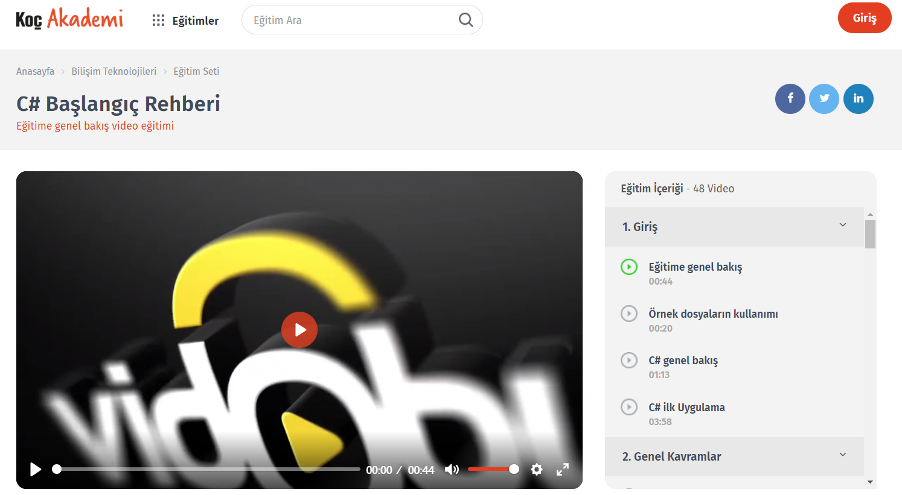

# C# Başlangıç Rehberi
Koç Akademinin ücretsiz C# başlangıç eğitimi, örnek kodları buraya ekledim. VLC Player'dan hızlı izleyebilmek için video eğitimlerini buradan indirebilirsiniz.  
https://drive.google.com/file/d/1kQ1M1j70KmrgJezMeXNXbXYKJOI7jYgp/view?usp=sharing  

> Bu eğitim setinde C#'ın temel özelliklerinden ve gelişim sürecinden, genel programlama kavramlarından, dizi ve kolleksiyonlardan, istisnai durum yönetiminden bahsedilmiştir. Class nedir ne amaçla kullanılır, metodlar ne işe yarar nasıl yazılırlar, nesne nedir ve nesnelerle nasıl çalışılır gibi bir çok sorunun cevabını bu eğitimde bulabilirsiniz. Bu eğitim seti sonunda sizlerde C# temellerini anlayıp kendi programlarınızı geliştirecek düzeye geleceksiniz.

https://www.kocakademi.com/egitim/c-baslangic-rehberi/

<!--- https://bit.ly/2yJA337 --->
